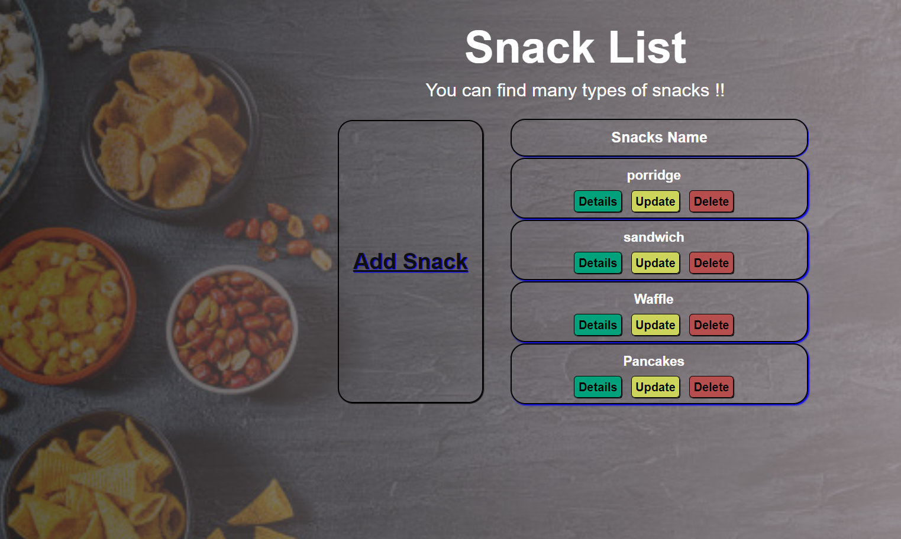
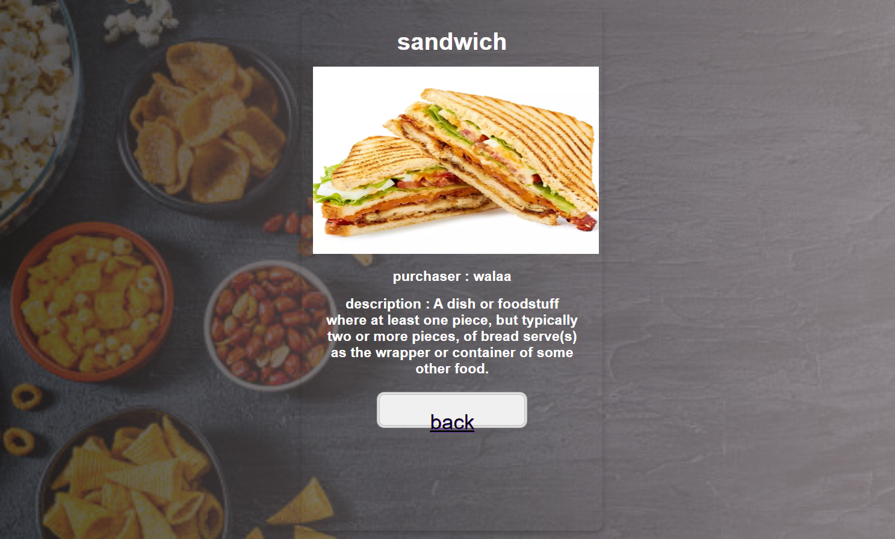
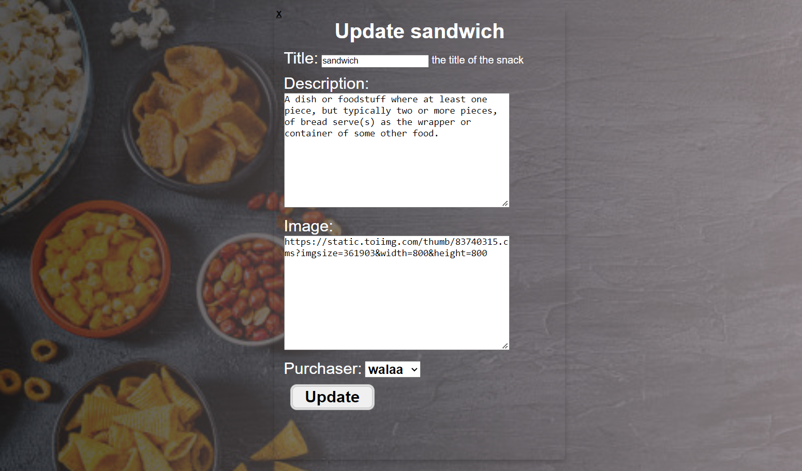
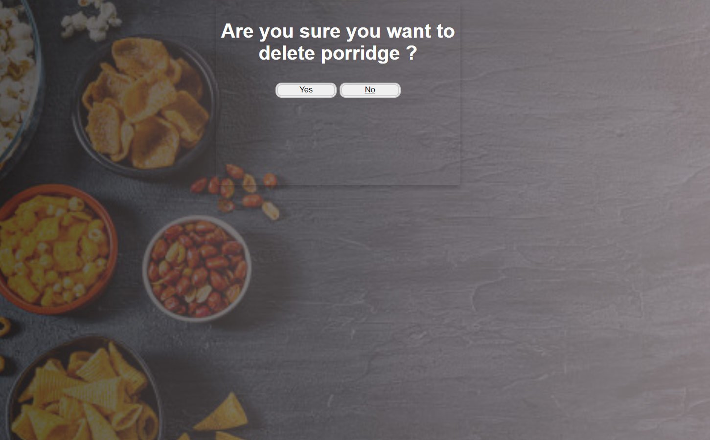

# LAB - Class 22

## Project: snacks_crud

### Author: Walaa' Atiyh
### object:

**The goal of this application is to collect information about the favorite snacks of the users of the application so that the user can add, update and delete snacks as I have developed a full stack application**

### project picture

#### How to initialize/run your application (where applicable)
1. **Create the venv and activate it.**

    `python3.10 -m venv .venv`
    `source .venv/bin/activate`

2. **Installing Django.**

    `pip install django`
    
   or 

   **install  requirements.txt**
   
   `pip3 install -r requirements.txt`

3. **To update the database**

    `python manage.py migrate`

4. **To run the server**

    `python manage.py runserver`

5. **To create an admin user**

    `python manage.py createsuperuser`

#### Tests
**To run the tests**
    `python manage.py test`
    
## [pull request](https://github.com/WalaaAtiah/snacks_crud/pull/1)
